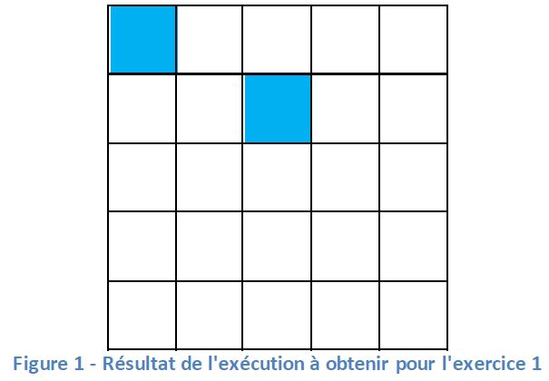

# Exercice 1

## Réaliser le motif ci-dessous

### Questions

Répondre aux questions
- Comment colorier un carré ?
- La couleur a –t-elle été précisée ?
- L’endroit où colorier a-t-il été précisé ?
- L’ordre des opérations a-t-il une importance ? Pourriez-vous changer l’ordre des opérations de votre programme et afficher la même grille ?